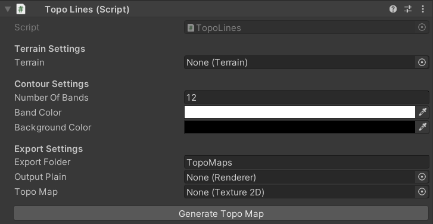

# Topo Map Generator
Create a topographic map based on unity terrain's heightmap

This script lets you generate a topographic map directly in the unity editor using Unity's terrain heightmap data to draw topographic lines map. This component was made with Lethal Company in mind, but it should work with any Unity Project that uses Unity Terrain.

You can add the DLL on releases to your Unity project and use the "Topo Lines" component in a game object to generate them.

## Field Explanations

The "Topo Lines" component has several configurable fields:

- **Terrain**: The Unity Terrain object from which the heightmap data will be extracted to generate the contour lines.
- **Number of Bands**: The number of elevation bands (contour lines) to display on the topographic map. Higher values create more detailed maps.
- **Band Color**: The color used for drawing the contour lines on the map.
- **Background Color**: The color for the areas between contour lines.
- **Export Folder**: The folder path (relative to Assets) where the generated topographic map textures and materials will be saved. A folder with the name of the scene will be automatically created inside that folder once you generate the topographic map.
- **Output Plain**: An optional Renderer component where the generated topographic map texture will be applied as the main texture.
- **Topo Map**: The generated Texture2D containing the topographic map (automatically created when generated for easy access).
- **Generate Topo Map**: Generates the topographic map as an asset, a material and a PNG file, it will replace the current topographic map generated if one already exists.

## Tips for Best Results in Lethal Company

- Change the terrain's heightmap resolution to 1025 for better detail and more vanilla-like appearance in the generated topographic map.
- Adjust the "Number of Bands" to find a balance between detail and readability. Too many bands can make the map look cluttered, while too few can oversimplify the terrain features. From experience, a value between 20 and 25 works well for Lethal Company moons.
- A "Plane" or "Quad" renderer are prefered. Just make sure to adjust the scale of the renderer to fit the size of the terrain for optimal display.
- Remember that only the terrain's heightmap data is used to generate the contour lines, so the topographic map will not reflect any other meshes or objects in the scene. You can edit the generated PNG file in an image editor to add any additional details or features if desired.
- Using a Max Size of 1024, compression in "Normal Quality" and Crunch Compression at a 100% will significantly reduce the file size of the generated topographic map without much loss in quality.

## Credits
- **[Dave29483 & AlucardJay](https://discussions.unity.com/t/turn-a-terrain-into-a-contoured-map/116441)**: Original code.
- **[Kenji](https://github.com/ismakenji)**: Made this version of the script to work as it does now.
- **[mrov](https://github.com/AndreyMrovol)**: Additional help and optimizations.